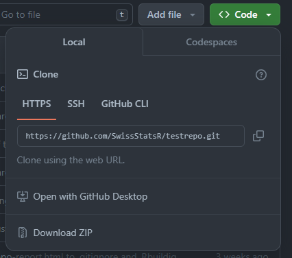
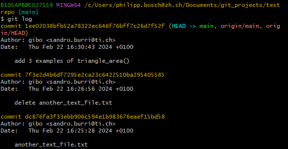
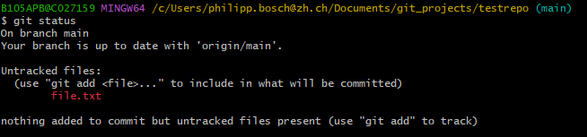
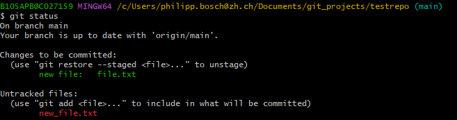

```{r setup, include=FALSE}
options(htmltools.dir.version = FALSE)
#icons::download_fontawesome()
knitr::opts_chunk$set(
  fig.width=9, fig.height=3.5, fig.retina=3,
  out.width = "100%",
  cache = FALSE,
  echo = TRUE,
  message = FALSE, 
  warning = FALSE,
  fig.show = TRUE,
  hiline = TRUE
)
```

```{r xaringan-themer, warning=FALSE, include=FALSE}
library(xaringanthemer)
ca_blue <- "#3863a2"
ca_blue2 <- "#3c61aa"
ca_dark_blue <- "#2d3b5a"
ca_green <- "#96c342"
gray <- "#3c3c3b"
black <- "#000000"
style_duo_accent(
  primary_color = ca_blue,
  secondary_color = ca_green,
  header_color = ca_blue,
  text_color = gray,
  code_inline_color = colorspace::lighten(black),
  text_bold_color = colorspace::lighten(black),
  link_color = ca_blue,
  title_slide_text_color = "#FFFFFF",
  inverse_header_color = "#FFFFFF",
  text_font_size = "1.2rem",
  header_font_google = google_font("Roboto", "300"),
          text_font_google = google_font("Roboto"),
          code_font_google = google_font("Fira Mono")
)
```


## Agenda

.pull-left[
#### Basics

- **Motivation**: Why Git?
- **Authentication**
- **"Downloading" Repositories**: Forking and Cloning
- **local workflow**: `git add` and `git commit`
- **"Uploading" and "Downloading" Commits**: `git push` and `git pull` 
- **Working with branches**


]


.pull-right[
  
]


.footnote[
The original and extended slides can be found here: [Git for Newbies Workshop Slides for the CorrelAid Project Cycle](https://correlaid.github.io/projektzyklus-workshops/00_kickoff-git-for-newbies/slides.html) by Frie Preu, licensed under Creative Commons Attribution 4.0 International
]


---
## Why Git?

.pull-left[

### 2014/15 - My BA
```bash
WS2014-15/BA/R
├── BA.R
├── Weighting.R
├── `droppedcode`.R
├── edvreg_Linzer-Lewis.R
├── edvreg_Linzer-Lewis_`modified`.R
├── edvreg_Linzer-Lewis_modified`1`.R
└── `final`models.R
```
]

.pull-right[

### 2017 - Hiwi job

```bash
hiwi/{prof}/eufunds/code/
├── data_wrangling.R
├── data_wrangling_nat.R
├── data_wrangling_`old`.R
├── map.R
├── maps`2`.R
└── plots.R
```

]

---

class: center, middle 


.footnote[
[Help Me Cat Gif](https://giphy.com/gifs/cat-fire-rescue-phJ6eMRFYI6CQ) via [Giphy](https://giphy.com), [original source](https://www.reddit.com/r/gifs/comments/3i5ynf/fire_cat_to_the_rescue/)
]
---

## Version Control to the Rescue!

- Example: [https://github.com/SwissStatsR/testrepo](https://github.com/SwissStatsR/testrepo)
- Just a little toy repo for this course

---
class: center, middle, inverse

# Requirements

---

## GitHub and Git

- Extensive and accessible intro: [Happy Git/hub with R](https://happygitwithr.com/)
  - create GitHub account
  - install Git
  - introduce yourself to Git

---
class: center, middle, inverse

# Authentication

---


## Authentification 

**GitHub needs to know that you are you!**

.pull-left[
  ### HTTPS
  
  - with GitHub username + password -> easy to understand (not recommended anymore)
  - with GitHub username + Personal Access Token (PAT) -> recommended
  - store PAT in git credential store to avoid entering over and over 
  - `git clone https://...` 
]
.pull-right[
 ### SSH
 
 - with a *keypair* (`id_rsa.pub` and `id_rsa`)
 - public key, private key cryptography (see e.g. [Youtube](https://www.youtube.com/watch?v=AQDCe585Lnc))
 - advantage: only set up once, no need to remember password
 - `git clone git@github.com:...`
]

---

class: center, middle, inverse

# Downloading Repositories - Fork and Clone

---

## Cloning a Repository 

### Repository
> A Git repository is a virtual storage of your project. It allows you to save versions of your code, which you can access when needed. <sup>1</sup>

 
.footnote[
[1] [Setting up a repository](https://www.atlassian.com/git/tutorials/setting-up-a-repository) by Atlassian Bitbucket, [Creative Commons Attribution 2.5 Australia License](https://creativecommons.org/licenses/by/2.5/au/)
]

--

`r emo::ji("bulb")` a repository can live at two places:
- only **local**: files are on your computer and nowhere else  
- only **remote**: files are stored online at GitHub/GitLab/...
- **local and remote**: files are both on your computer and stored online, **and the repositories can be different**

---

## Fork and Clone

### Fork
> A fork is a copy of a repository. Forking a repository allows you to freely experiment with changes without affecting the original project. <sup>1</sup> 

A *fork* can only be created online and not locally.

### Clone 
> When you create a repository on GitHub, it exists as a remote repository. You can clone your repository to create a local copy on your computer and sync between the two locations.  <sup>2</sup>
 
.footnote[
[1] [Fork a repo](https://docs.github.com/en/github/getting-started-with-github/fork-a-repo) by GitHub Docs team and contributors, [Creative Commons Attribution 4.0 International](https://github.com/github/docs/blob/main/LICENSE)

[2] [Cloning a repository](https://docs.github.com/en/github/creating-cloning-and-archiving-repositories/cloning-a-repository) by GitHub Docs team and contributors, [Creative Commons Attribution 4.0 International](https://github.com/github/docs/blob/main/LICENSE)
]

---

## Showcase - Clone a Repo with the Command Line

.pull-left[
1. Use `cd` in your terminal or Git bash to navigate to your target location (use the tab key for autocompletion)
2. Use `git clone` and either the HTTPS  or SSH  URL of the repository
]

.pull-right[

 
]

---

## Showcase - Clone a Repo with RStudio

.pull-left[
1. In the top right corner,  click on the dropdown and choose New project
2. Select "Version Control"
3. Follow the dialogue
]

.pull-right[


]

---

class: center, middle, inverse

# What is Git?

---

## Git Snapshots

> Git thinks of its data more like a series of snapshots of a miniature filesystem. With Git, every time you commit, or save the state of your project, Git basically takes a picture of what all your files look like at that moment and stores a reference to that snapshot. <sup>1</sup>


.footnote[
[1] [Getting Started - What is Git?](https://www.git-scm.com/book/en/v2/Getting-Started-What-is-Git%3F)
]

---

## The Three States

Git has three main states that your files can reside in: modified, staged, and committed:

- **Modified** means that you have changed the file but have not committed it to your database yet.
- **Staged** means that you have marked a modified file to go into your next commit snapshot.
- **Committed** means that the data is safely stored in your local database.


---

## Git History

> Everything in Git is checksummed before it is stored and is then referred to by that checksum. This means it’s impossible to change the contents of any file or directory without Git knowing about it.<sup>1</sup>

Git stores a history of snapshots / commits in its graph. 

```bash
git log
```
.pull-right[

]

.footnote[
[1] [Getting Started - What is Git?](https://www.git-scm.com/book/en/v2/Getting-Started-What-is-Git%3F)
]


---

class: center, middle, inverse


# The Local Workflow - Add und Commit 

---
## Commit

> A commit is the Git equivalent of a "save".[...] Git committing is an operation that acts upon a collection of files and directories. <sup>1</sup>

--> Commit = a "save point" or snapshot in Git. 

The basic Git workflow goes something like this:

1. You modify files in your working tree.
2. You selectively stage just those changes you want to be part of your next commit, which adds only those changes to the staging area.
3. You do a **commit**, which takes the files as they are in the staging area and stores that snapshot permanently to your Git directory.

.footnote[
[1] [Saving changes](https://www.atlassian.com/git/tutorials/saving-changes) by Atlassian Bitbucket, [Creative Commons Attribution 2.5 Australia License](https://creativecommons.org/licenses/by/2.5/au/)
]

---

## Commit

- a commit stores **a full snapshot** of the current state of the repository
- to the user, it is shown as so-called "diffs", i.e. what has changed since the last commit
  - edits of file(s)
  - creation of new file(s)
  - deletion of file(s)
  - renaming of file(s)

--> making a commit = taking a snapshot 
---

class: center

## Steps to Create a Commit

.pull-left[

[Staging Area illustration](https://git-scm.com/images/about/index1@2x.png), from [About - Staging Area](https://git-scm.com/about/staging-area) by Scott Chacon and contributors, licensed under [Creative Commons Attribution 3.0 Unported License](https://creativecommons.org/licenses/by/3.0/)

]
.pull-right[

**The "repository" is stored in the `.git` folder in your your project folder**

]


---

## Making a Commit - Adding

In the staging area, you **draft** your commit and choose which of your changes you want to "save" in Git


**Most important Git command**: see what is currently going on `r emo::ji("eyes")`

```bash
git status
```

```bash
git diff
git diff --staged
```

Add individual files or folders

```bash
git add {path} (-p)
```

or everything

```bash
git add .
```

---
## Making a Commit - Adding

```bash
git status
```



We add `file.txt` to our "commit draft": 

```bash
git add file.txt
```

---

## Making a Commit - Adding

`new_file.txt` will not be part of the commit:



Before you run `git commit` make sure you always! inspect the changes first with `git status`.

---

## Making a Commit - Commit

Now, we can commit:
```bash
git commit -m "change file.txt"
```

A commit must have a commit message. If you omit `-m`, `git` will open the default editor so you can enter a message. 


---

## Making a Commit - Shortcuts

We can add all changes with: 

```bash
git add .
```


... or even commit all our changes directly without `git add`:

```bash
git commit -a -m 'directly committing all changes'
```

<font color="red">it's tempting but use both with care!</font>

---

## Making a Commit in RStudio

.pull-left[
- Git pane, then "Commit" button -> extra window opens
- `git add`: tick checkboxes
- `git commit`: commit message in box, then press commit
]
.pull-right[
```{r, echo=FALSE, out.width="100%"}
knitr::include_graphics("images/rstudio/git_commit.png")
```
]


---
class: center, middle, inverse

# Sync Files - Push and Pull

---


## Git Hosting

- GitHub: `r icons::fontawesome("github")` 
- GitLab: `r icons::fontawesome("gitlab")` 
- Bitbucket: `r icons::fontawesome("bitbucket")`
- Keybase: `r icons::fontawesome("keybase")` 

---

## Git local and Git remote

- **local**: your laptop/machine
- **remote**: in the Cloud (GitLab, GitHub...) - you typically only have one remote (called "origin") but you can have multiple

```bash
$ git remote -v
origin  https://github.com/SwissStatsR/testrepo.git (fetch)
origin  https://github.com/SwissStatsR/testrepo.git (push)

```


---

## Sync: Git Pull and Git Push

"Download" new commits from GitHub

```bash
git pull
```

"Upload" your local commits to GitHub

```bash
git push
```

---

## Pull and Push - RStudio

- Git pane / Git commit window
- button down (blue): pull
- button up (green): push


---

## Pull, Commit, Push Workflow

1. Run `git pull` before you resume your work to get the updates from your team mates that they have uploaded 
2. Run `git add` whenever you feel like you have achieved something or you want to "save" some intermediate code snippets 
3. Run `git commit` when you are ready to save your changes as a new snapshot (commit often!)
4. Run `git push` to share your commits with others or to "backup" your work

---

class: center, middle

## Git Quizzed!


---
class: center, middle


## Git Quizzed!


---
class: center, middle, inverse

# When Things Go Wrong...

---
class: center, middle


---

## When Things Go Wrong...

1. as long nothing is pushed, all is (kind of) OK -> don't push if things are messed up!
2. if things are really messed up: save your code somewhere else and clone again
3. read the error messages, they can be quite useful!


There are special Git commands to help you in case of unwanted changes like [git restore](https://www.git-scm.com/docs/git-restore), [git reset](https://www.git-scm.com/docs/git-reset), and [git rebase](https://www.git-scm.com/docs/git-rebase). However, you have to really understand them before you apply them!

---
class: center, middle


## Branches 


---


## Branches

.smaller[
### Branch
> A branch represents an independent line of development. Branches serve as an abstraction for the edit/stage/commit process. You can think of them as a way to request a brand new working directory, staging area, and project history.<sup>1</sup>

### Checkout

> The git checkout command lets you navigate between the branches created by `git branch`. Checking out a branch updates the files in the working directory to match the version stored in that branch, and it tells Git to record all new commits on that branch. Think of it as a way to select which line of development you’re working on.<sup>2</sup> 


.footnote[
[1] [Git Branch](https://www.atlassian.com/git/tutorials/using-branches) by Atlassian Bitbucket, [Creative Commons Attribution 2.5 Australia License](https://creativecommons.org/licenses/by/2.5/au/)

[2] [Git Checkout](https://www.atlassian.com/git/tutorials/using-branches/git-checkout) by Atlassian Bitbucket, [Creative Commons Attribution 2.5 Australia License](https://creativecommons.org/licenses/by/2.5/au/)
]
]

---

## Why Branches?

- stability: only have working code on "main" branch 
  - e.g. CI/CD directly to dev
  - users download your code from GitHub / GitHub (e.g. `devtools::install_github()`)
--

- collaboration: independent development of code ("feature branches") 
--

- experiments: try it out in a branch
--

- example: [https://github.com/tidyverse/dplyr/branches](https://github.com/tidyverse/dplyr/branches)

---

## Branches Workflow

1. create a branch in Git with a meaningful name (e.g. `issue1-add-favorite-gif`)

   ```
   git switch -c "#1-add-favorite-gif"
   ```

   ```
   git checkout -b "#1-add-favorite-gif
   ```
--

2. checkout branch: branch is automatically checked out (check with `git graph`: `HEAD` points to `#1-add-favorite-gif`)

--

3. continue working as usual (pull-commit-push cycles)
--

4. (optional): merge other branches into your branch to get their updates: `git merge {branch_name}`

--

5. merge your branch into the main branch (checkout main, then see 4.) (better: Pull-Request)


`r emo::ji("white_check_mark")`  You can always switch between branches using `git checkout`. This will modify your working tree and load all files for this branch. However, uncommitted files will be unaffected and stay!

---
## Branches Workflow - RStudio

.pull-left[
- Git pane, then on the right
- creating a branch: click on purple icon
- switch branches: click on dropdown / branch name
]
.pull-right[

]
